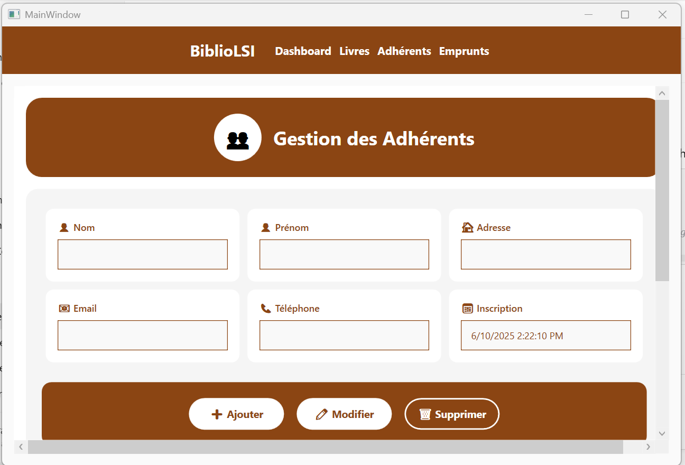
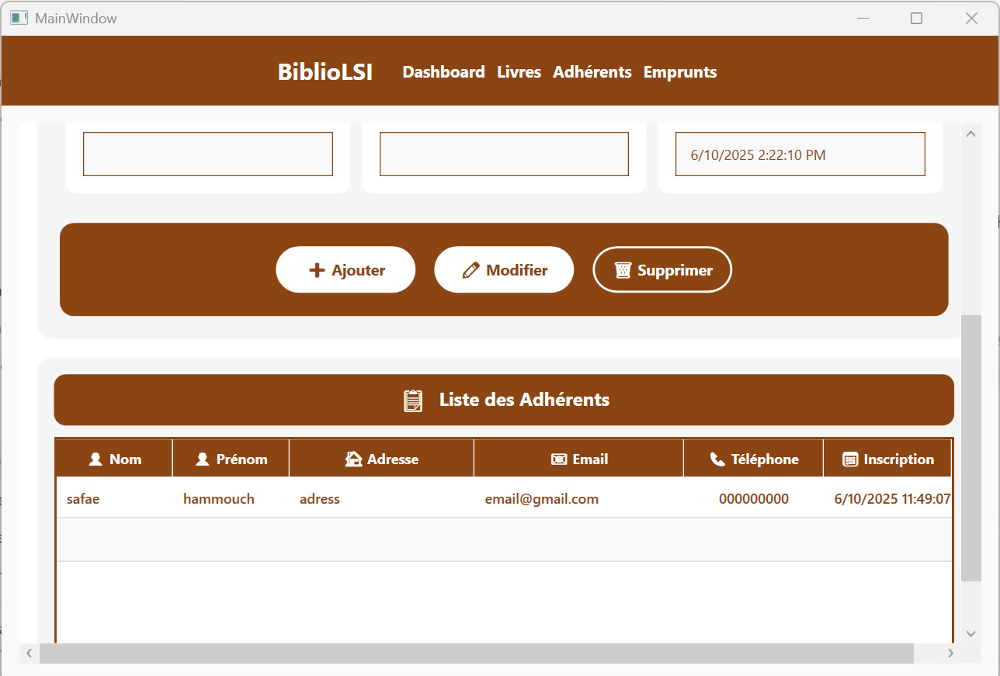
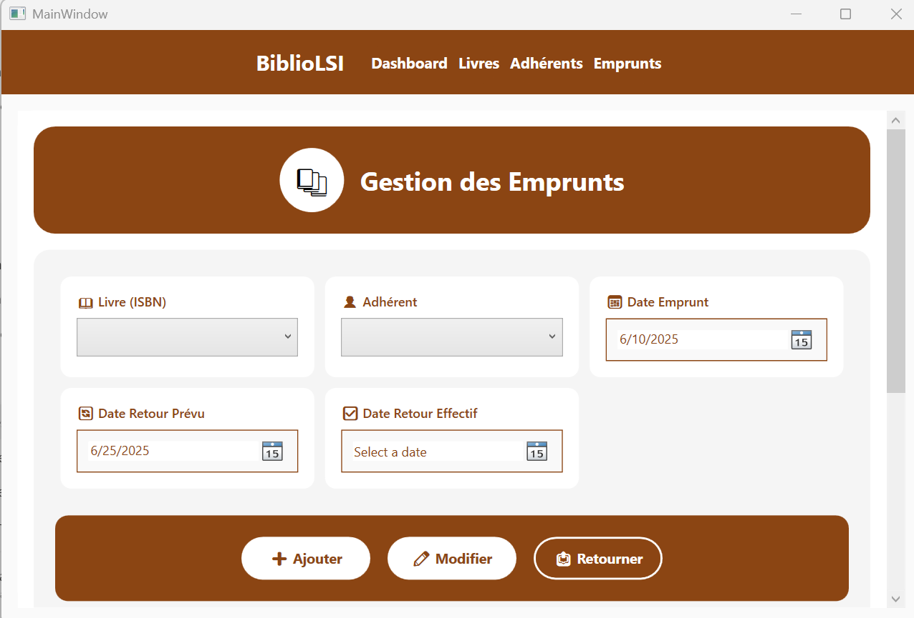
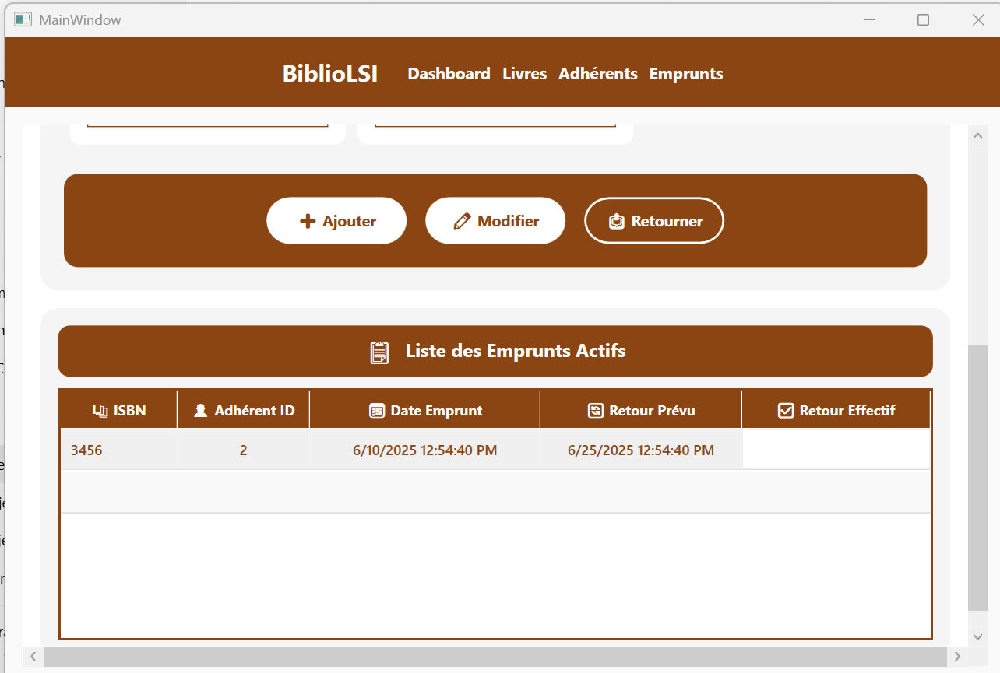

````markdown
#  🌟  BiblioGest-LSI – Your Modern Library Management Solution

Welcome to **BiblioGest-LSI**, a sleek and powerful library management application built using C# and WPF. Crafted as a student project, this application streamlines book, member, and loan management with an intuitive interface and robust functionality.

## 👥 Project Team

- **Developers**: Oumaima Boughdad & Safae Hammouch  
- **Mentor**: Prof. Hassan ZILI

---

## 🚀 Getting Started

Follow these steps to set up and run BiblioGest-LSI on your local machine.

### Prerequisites

- Visual Studio (2019 or later) with .NET Framework or .NET Core
- PostgreSQL (version 12 or later)
- Git

### Setup Instructions

#### Clone the Repository

```bash
git clone https://github.com/safae97/WPF-BiblioGest-LSI.git
cd WPF-BiblioGest-LSI
````

---

### 🗄️ Configure the Database

Open `Data/AppDbContext.cs` in Visual Studio and update the PostgreSQL connection string with your credentials:

```csharp
options.UseNpgsql("Host=localhost;Port=5432;Database=name_of_database;Username=postgres;Password=your_password");
```

> Replace `your_password` with your actual PostgreSQL password.

---

### 🧱  Apply Database Migrations

Open **Package Manager Console** in Visual Studio:

```
Tools > NuGet Package Manager > Package Manager Console
```

Then run:

```powershell
Add-Migration InitialCreate
Update-Database
```

---

### 🏃 Run the Application

1. Open `BiblioGest.sln` in Visual Studio.
2. Press `F5` or click **Run** to launch the application.

---

##📁 Project Architecture

```
📦 BiblioGest
├── 📁 Commands/         # Custom commands (e.g., RelayCommand)
├── 📁 Data/             # Database context and migrations
├── 📁 Models/           # Entities (Book, Member, Loan)
├── 📁 ViewModels/       # Business logic and data binding
├── 📁 Views/            # WPF user interfaces
```

---

## ✅  Requirements Met

* 📚 Book Management (CRUD)
* 👤 Member Management (CRUD + loan history)
* 📅 Loan Management (create, return, overdue detection)
* 📊 Dashboard with real-time statistics and visual charts

---

## 📸 Screenshots


### 📊 Admin Dashboard


### 📚 Book Management


### 👤 Member Management







### 📅 Loan Management







---

## 🧪 Sample Test Data

### 📘 Book

```json
{
  "ISBN": "978-0142437230",
  "Title": "Moby-Dick",
  "Author": "Herman Melville",
  "Publisher": "Penguin Classics",
  "Year": 1851,
  "Category": "Fiction",
  "Stock": 5
}
```

### 👤 Member

```json
{
  "LastName": "Smith",
  "FirstName": "Emma",
  "Email": "emma.smith@example.com",
  "Phone": "555-123-4567",
  "Address": "123 Main St"
}
```

### 📅 Loan

```json
{
  "BookISBN": "978-0142437230",
  "MemberId": 1,
  "LoanDate": "2025-06-10",
  "DueDate": "2025-06-24"
}
```

---


## 🔮 Future Enhancements

* 📤 Export data to CSV/Excel
* 🔐 Role-based access (admin/user)
* 📱 Mobile app using .NET MAUI
* 🔍 Advanced search/filtering
* 📧 Email alerts for overdue books

---

## 🙌 Acknowledgments

A special thank you to **Prof. Hassan ZILI** for mentorship and guidance throughout the project.

```
