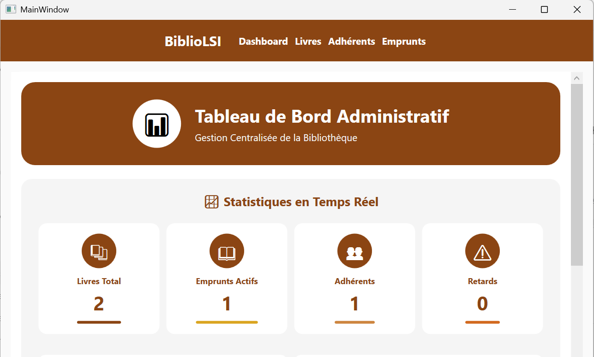
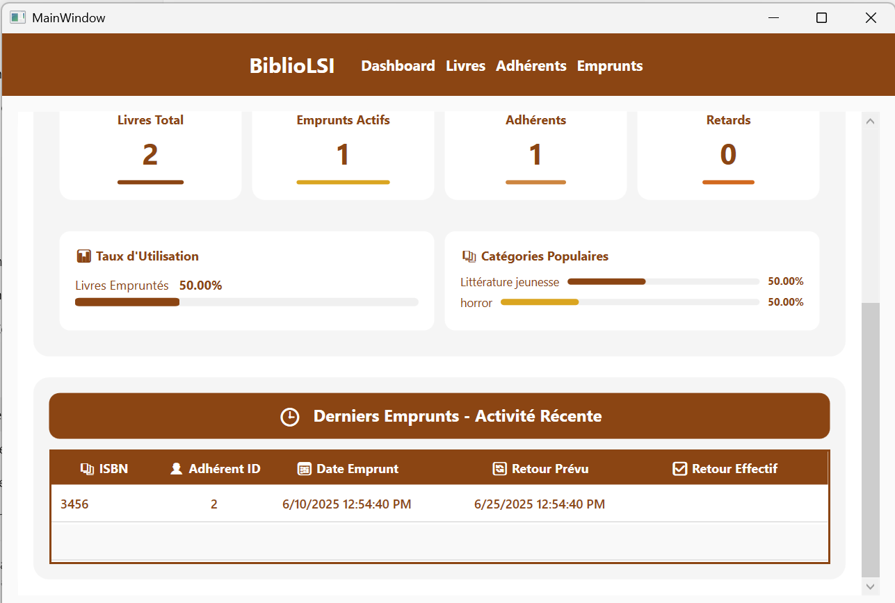
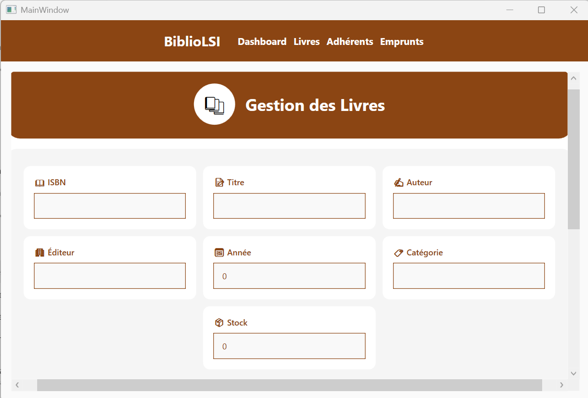
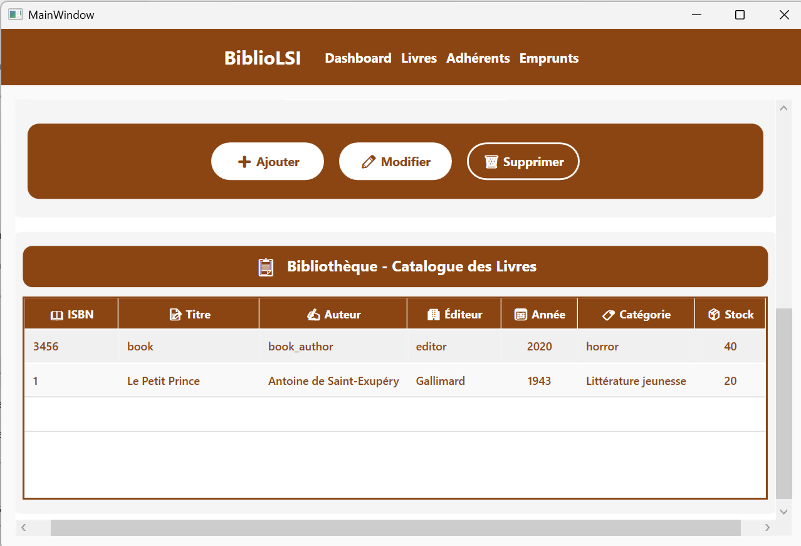

#  🌟  BiblioGest-LSI – Votre Solution Moderne de Gestion de Bibliothèque

Bienvenue sur **BiblioGest-LSI**, une application élégante et puissante de gestion de bibliothèque développée avec C# et WPF. Conçue comme un projet étudiant, cette application simplifie la gestion des livres, des membres et des prêts grâce à une interface intuitive et des fonctionnalités robustes.

## 👥 Équipe du Projet

- **Développeurs**: Oumaima Boughdad & Safae Hammouch  
- **Mentor**: Prof. Hassan ZILI

---

## 🚀 Mise en Route

Suivez ces étapes pour configurer et exécuter BiblioGest-LSI sur votre machine locale.

### Prérequis

- Visual Studio (2019 ou ultérieur) avec .NET Framework ou .NET Core
- PostgreSQL (version 12 ou ultérieure)
- Git

### Instructions de Configuration à Suivre

#### Cloner le Dépôt

```bash
git clone https://github.com/safae97/WPF-BiblioGest-LSI.git
cd WPF-BiblioGest-LSI
```

### 🗄️ Configurer la Base de Données

Ouvrez `Data/AppDbContext.cs` dans Visual Studio et mettez à jour la chaîne de connexion PostgreSQL avec vos identifiants:

```csharp
options.UseNpgsql("Host=localhost;Port=5432;Database=name_of_database;Username=postgres;Password=your_password");
```

> Remplacez `your_password` par votre mot de passe PostgreSQL réel.

---

### 🧱 Appliquer les Migrations de Base de Données

Ouvrez la **Console du Gestionnaire de Packages** dans Visual Studio:

```
Outils > Gestionnaire de Package NuGet > Console du Gestionnaire de Packages
```

Puis exécutez:

```powershell
Add-Migration InitialCreate
Update-Database
```

---

### 🏃 Exécuter l'Application

1. Ouvrez `BiblioGest.sln` dans Visual Studio.
2. Appuyez sur `F5` ou cliquez sur **Exécuter** pour lancer l'application.

---

## 📁 Architecture du Projet

```
📦 BiblioGest
├── 📁 Commands/         # Commandes personnalisées (ex: RelayCommand)
├── 📁 Data/             # Contexte de base de données et migrations
├── 📁 Models/           # Entités (Livre, Membre, Prêt)
├── 📁 ViewModels/       # Logique métier et liaison de données
├── 📁 Views/            # Interfaces utilisateur WPF
```

---

## ✅ Exigences Satisfaites

* 📚 Gestion des Livres (CRUD)
* 👤 Gestion des Membres (CRUD + historique des prêts)
* 📅 Gestion des Prêts (création, retour, détection des retards)
* 📊 Tableau de bord avec statistiques en temps réel et graphiques visuels

---

## 📸 Captures d'Écran

### 📊 Tableau de Bord Administrateur







### 📚 Gestion des Livres







### 👤 Gestion des Membres


### 📅 Gestion des Prêts


---

## 🧪 Exemples de Données de Test

### 📘 Livre

```json
{
  "ISBN": "978-0142437230",
  "Title": "Moby-Dick",
  "Author": "Herman Melville",
  "Publisher": "Penguin Classics",
  "Year": 1851,
  "Category": "Fiction",
  "Stock": 5
}
```

### 👤 Membre

```json
{
  "LastName": "Smith",
  "FirstName": "Emma",
  "Email": "emma.smith@example.com",
  "Phone": "555-123-4567",
  "Address": "123 Main St"
}
```

### 📅 Prêt

```json
{
  "BookISBN": "978-0142437230",
  "MemberId": 1,
  "LoanDate": "2025-06-10",
  "DueDate": "2025-06-24"
}
```

---

## 🔮 Améliorations Futures

* 📤 Exportation des données vers CSV/Excel
* 🔐 Accès basé sur les rôles (administrateur/utilisateur)
* 📱 Application mobile utilisant .NET MAUI
* 🔍 Recherche/filtrage avancé
* 📧 Alertes par e-mail pour les livres en retard

---

## 🙌 Remerciements

Un remerciement spécial au **Prof. Hassan ZILI** pour son mentorat et ses conseils tout au long du projet.